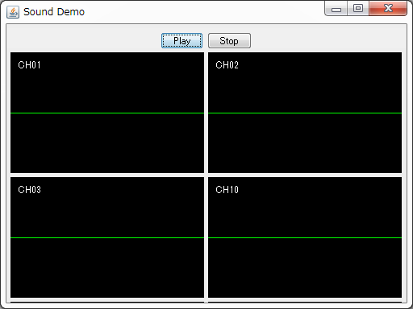
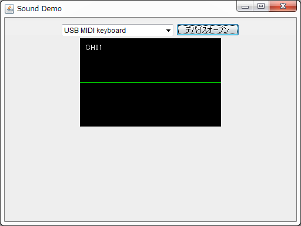

## synth
実行にはJava6以上のJavaランタイムが必要です。
インストールされてない場合は[ここ](http://java.com/ja/)からランタイムをインストールしてください。 

製作途中なので正しく動作しない場合があります。

### 動作イメージ
<iframe width="425" height="355" src="https://www.youtube.com/embed/WdYxJF_953o" frameborder="0" allow="accelerometer; autoplay; encrypted-media; gyroscope; picture-in-picture" allowfullscreen></iframe>  
java Nes Synth Demo

### softsynth.jar
ソフトシンセライブラリ本体です。
単体では動作しません、自作ゲーなどに組み込んで利用してください。
使い方は下記のプレーヤーのソースとJavaDocを参照してください。

### SoftSynthDemo.jar

簡易プレーヤーです。
MidiファイルをＤ＆Ｄすると再生が始まります。
jarの中にソースも含めているので、気になる方は参照してください。

### MidiKeyDemo.jar

簡易ピアノです。
利用するにはMIDIキーボードが必要になります。
jarの中にソースも含めているので、気になる方は参照してください。

### MidiKeyDemo_TETO.jar
簡易プレーヤーのおまけ版です。
UTAU用音声ライブラリの重音テトを利用してます。
作成途中のため非常に音痴です。

## ダウンロード
[最新版](synth.asset/java_syn.zip)
